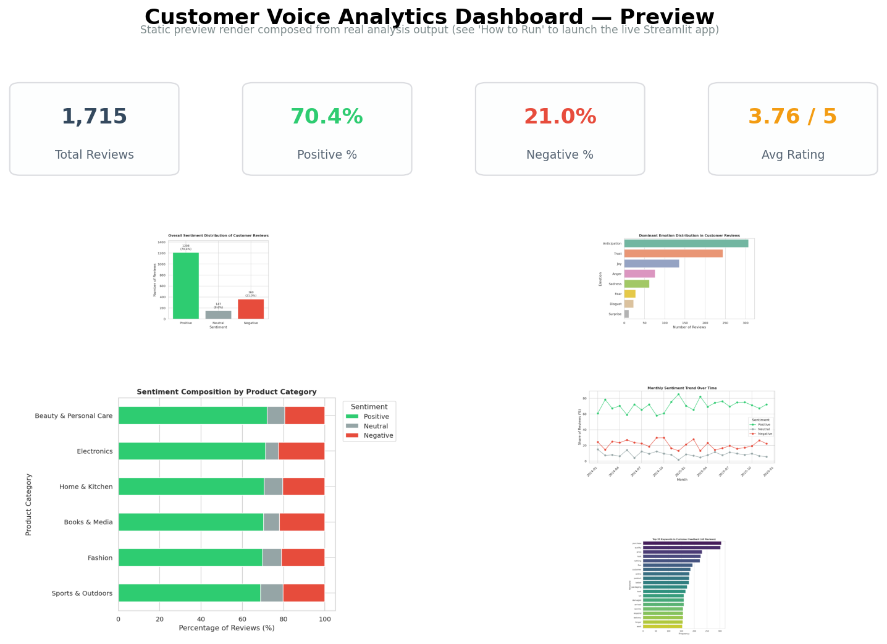
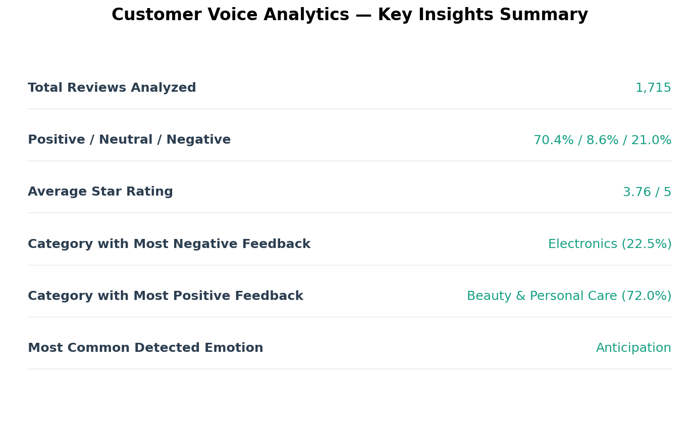
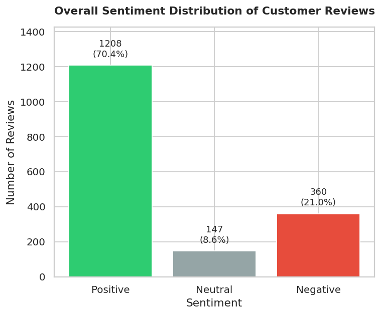
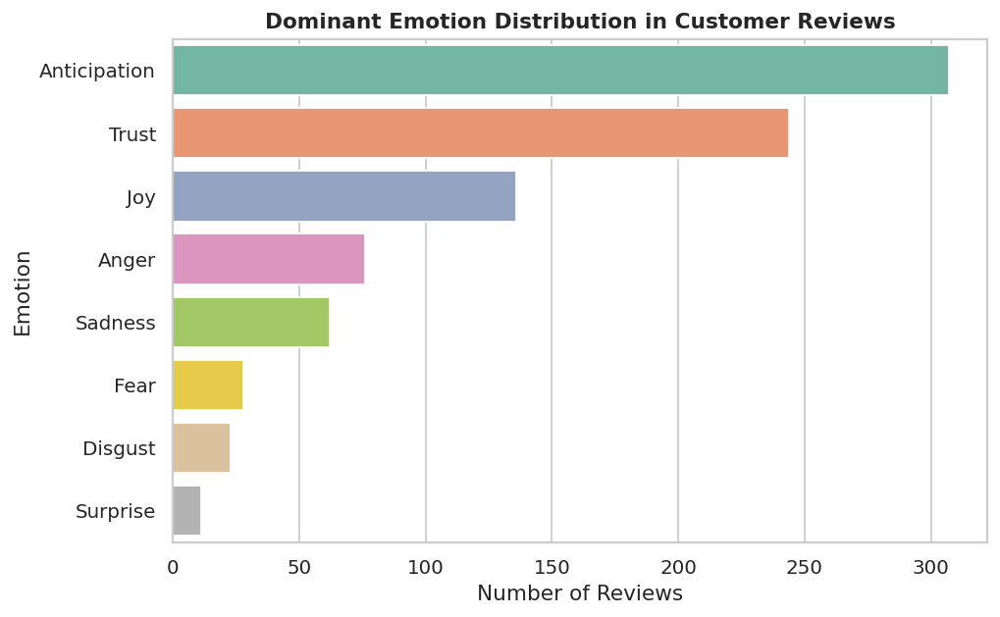

# 🗣️ Customer Voice Analytics — NLP Sentiment & Emotion Intelligence

**An end-to-end NLP / Data Analytics project that classifies customer product reviews into Positive, Negative, and Neutral sentiment, detects the underlying emotion, and turns the results into actionable business recommendations.**


---

## 📸 Project Screenshots

| Dashboard Preview | Key Insights Summary |
|---|---|
|  |  |

| Sentiment Distribution | Emotion Analysis |
|---|---|
|  |  |

> The dashboard image above is a **static preview render** built from the project's real, computed
> analysis output (charts + metrics) rather than a captured browser screenshot, since this build
> environment has no headless-browser tool available. Launch `streamlit run dashboard/app.py` to see
> the fully interactive, live version. All numbers shown are genuine outputs of the pipeline — see
> [Reproducibility](#-installation--how-to-run) to regenerate them yourself.

---

## 📌 Problem Statement

Businesses collect thousands of customer reviews across products and categories, but manually reading
every review to gauge customer sentiment doesn't scale. Star ratings alone are a blunt instrument —
they don't explain **why** a customer felt the way they did, and they can be misleading (a 3★ review
can hide a genuinely angry customer, or a genuinely happy one). This project builds an automated NLP
pipeline that reads review text directly to surface sentiment, emotion, and business-relevant patterns.

## 🎯 Business Objective

Build a reproducible NLP analytics pipeline that:
- Classifies every review as **Positive / Negative / Neutral**
- Detects the **dominant emotion** behind each review (joy, anger, trust, fear, sadness, etc.)
- Surfaces **trends and patterns** in customer opinion across products, categories, and time
- Converts findings into **actionable recommendations** for Marketing, Product, and Customer Experience teams

## ✨ Features

- 🧹 Realistic data cleaning pipeline (missing values, duplicates, HTML/URL stripping, normalization)
- 🔤 NLP text preprocessing (tokenization, stopword removal, lemmatization) — kept separate from sentiment scoring so punctuation/casing signal isn't lost
- 😊 Lexicon-based sentiment classification with **VADER**
- 🎭 Emotion detection (8 emotions) with the **NRC Emotion Lexicon**
- 📊 11+ professional static charts + a fully interactive **Streamlit dashboard**
- ☁️ Word clouds and keyword-frequency analysis for positive vs. negative reviews
- 📈 Rating-vs-sentiment cross-checks that surface mismatched/sarcastic reviews
- 💡 Auto-generated, data-driven Key Insights and Business Recommendations sections
- 🔁 Fully reproducible from a fresh clone — no manual dataset download required

---

## 🗂️ Dataset Information

This project uses a **synthetic-but-realistic** customer review dataset generated by
[`src/generate_dataset.py`](src/generate_dataset.py).

**Why synthetic, and why that's disclosed openly:** Public review datasets (Amazon/Flipkart/Yelp
reviews, etc.) are usually multi-GB Kaggle downloads that can break, require an API key, or simply
aren't reachable from an offline/reproducible build. Rather than silently working around that or
falsely claiming to use a specific company's real data, the dataset here is generated
programmatically from realistic, rating-conditioned review-writing patterns across 6 real-world
product categories and 36 products, with **deliberately injected data-quality noise** — missing
values, duplicate reviews, empty strings, HTML fragments, stray URLs, emoji, inconsistent casing —
so the cleaning pipeline has genuine, realistic work to do, just like production review data.

| Property | Value |
|---|---|
| Raw rows generated | 1,854 |
| Rows after cleaning | 1,715 |
| Product categories | 6 (Electronics, Fashion, Home & Kitchen, Beauty & Personal Care, Sports & Outdoors, Books & Media) |
| Distinct products | 36 |
| Date range | 2024-01-01 to 2025-12-31 |
| Columns | `review_id`, `product_category`, `product_name`, `review_text`, `rating`, `review_date`, `verified_purchase`, `helpful_votes` |

The dataset is included directly in this repository at [`data/dataset.csv`](data/dataset.csv) — no
external download is required. To regenerate it (e.g. with a larger sample size or a different
random seed): `python src/generate_dataset.py`.

---

## 🛠️ Technologies Used

| Category | Tools |
|---|---|
| Language | Python 3.10+ |
| Data handling | Pandas, NumPy |
| NLP | NLTK (tokenization, stopwords, lemmatization) |
| Sentiment analysis | VADER (`vaderSentiment`) |
| Emotion analysis | NRC Emotion Lexicon (`NRCLex`) |
| Visualization | Matplotlib, Seaborn, Plotly, WordCloud |
| Machine learning utilities | Scikit-learn |
| Dashboard | Streamlit |
| Notebook | Jupyter |

---

## 🔄 Project Workflow

```
Dataset Generation → Data Loading → Data Understanding → Data Cleaning
        → NLP Text Preprocessing → Sentiment Analysis (VADER)
        → Emotion Analysis (NRC Lexicon) → Descriptive/Statistical Analysis
        → Visualization → Key Insights → Business Recommendations
        → Interactive Dashboard
```

### Data Cleaning Methodology
- Drop rows with missing/empty review text (nothing to score sentiment on)
- Drop rows with missing/invalid star ratings (must be an integer 1–5)
- Strip stray HTML fragments and URLs from review text
- Normalize whitespace (collapse repeated spaces, trim)
- Remove exact duplicate reviews (same product + same text)
- Parse `review_date` into a real datetime column, dropping unparseable dates

### NLP Methodology
A **second**, heavily-normalised text column (`clean_tokens`) is built specifically for
word-frequency / word-cloud analysis: lowercasing → emoji/URL/HTML removal → punctuation & digit
removal → tokenization → stopword removal (**negation words like "not"/"no"/"never" are deliberately
kept** so phrases like "not good" aren't misread) → lemmatization.

Importantly, **this heavily-processed column is NOT what's fed into VADER.** VADER is a rule-based
tool that uses capitalization and punctuation (e.g. "AMAZING!!!") as genuine sentiment signal, so
sentiment scoring runs on the original, lightly-cleaned `review_text` column instead.

### Sentiment Analysis Methodology
[VADER](https://github.com/cjhutto/vaderSentiment) returns a compound score in `[-1, 1]` per review,
bucketed using VADER's standard thresholds:

| Compound Score | Label |
|---|---|
| ≥ 0.05 | Positive |
| ≤ -0.05 | Negative |
| in between | Neutral |

This is a **lexicon-based classification, not a trained supervised model** — no classification
"accuracy" is reported anywhere in this project, because there is no independently-labelled
ground truth to validate against. Where useful, VADER's label is cross-checked against the star
rating purely as a descriptive sanity check (e.g. to flag reviews where the text sentiment disagrees
with the numeric rating).

### Emotion Analysis Methodology
The [NRC Emotion Lexicon](https://saifmohammad.com/WebPages/NRC-Emotion-Lexicon.htm) (via the
`NRCLex` package) maps individual words to 8 basic emotions: anger, anticipation, disgust, fear,
joy, sadness, surprise, and trust. Each review is assigned its **dominant (most frequent) emotion**
among its emotion-bearing words; reviews with none are labelled `None Detected`.

**Limitation (stated explicitly):** NRC is a *word-level* lexicon with no concept of negation,
sarcasm, or sentence context — results reflect the emotional tone of a review's vocabulary, not a
certified psychological read of the reviewer.

---

## 📊 EDA Findings & Key Insights

*(All numbers below are real outputs of the pipeline on the shipped `data/dataset.csv` — reproduce
them yourself with `notebooks/sentiment_analysis.ipynb`. Because the dataset is randomly generated
with a fixed seed, re-running `generate_dataset.py` as-is reproduces these exact figures; changing
the sample size or seed will naturally shift them slightly.)*

- **1,715** reviews were analyzed after cleaning (removed **139** rows — **7.5%** — that were
  missing/empty text, had invalid ratings, or were exact duplicates).
- Overall sentiment split: **70.4% Positive**, **8.6% Neutral**, **21.0% Negative**.
- Average star rating across the dataset: **3.76 / 5**.
- Sentiment tracks star rating strongly at the extremes: 1★ and 2★ reviews are overwhelmingly
  negative in text, 4★ and 5★ overwhelmingly positive — but 3★ reviews are genuinely mixed
  (roughly split across all three sentiment labels), showing a "neutral" numeric score often hides
  real emotional content in the written review.
- **Electronics** has the highest share of negative reviews among all categories (**22.5%**);
  **Beauty & Personal Care** has the highest share of positive reviews (**72.0%**).
- The most common detected emotion across the corpus (excluding reviews with no emotion-bearing
  words) is **Anticipation**, followed by Trust and Joy — consistent with a majority-positive
  review base — while Anger and Sadness cluster heavily within the negative-review subset.
- A measurable number of reviews show a **mismatch between star rating and text sentiment**
  (e.g. a 1–2★ rating paired with positive-sounding text, or a 4–5★ rating paired with
  negative-sounding text) — see the notebook's Statistical Analysis section for exact counts. These
  are strong candidates for manual review, since they may reflect sarcasm, accidental mis-ratings,
  or confusion between product quality and delivery experience.
- Negative feedback is not evenly distributed across categories — the word clouds and top-keywords
  chart reveal recurring complaint themes (e.g. *"flimsy," "broke," "size," "damaged," "refund"*)
  concentrated in specific categories, and recurring praise themes (*"great," "quality," "fast,"
  "comfortable"*) concentrated in others.

---

## 💡 Business Recommendations

**Product Development**
- Prioritize a root-cause review of the category with the highest negative-sentiment share
  (Electronics, 22.5% negative in this run) — the negative word cloud and top-keywords chart
  surface recurring complaint themes fast.
- Feed recurring negative keywords (quality, sizing, packaging damage) into QA/supplier checklists.

**Marketing**
- Lean into the messaging that's already working in the strongest category (Beauty & Personal
  Care, 72.0% positive) — its recurring positive keywords are ready-made testimonial language.
- Use verified, high-`helpful_votes` positive reviews as social proof on category landing pages.

**Customer Experience**
- Route rating/sentiment-mismatch reviews to a support queue for manual follow-up — they often
  surface delivery or service issues invisible in the star rating alone.
- Track the monthly sentiment trend chart as an early-warning KPI ahead of promotions or launches.

**Business Decision-Making**
- Treat the sentiment/emotion breakdown as a recurring KPI (via the Streamlit dashboard) rather
  than a one-off report, so category-level shifts in customer sentiment are caught early.

---

## 🖥️ Dashboard

An interactive Streamlit dashboard (`dashboard/app.py`) runs the same pipeline
(`src/data_cleaning.py`, `src/sentiment_analysis.py`) live and lets you explore the data with filters.

**Includes:**
- Total Reviews, Positive %, Neutral %, Negative %, Average Rating (metric cards)
- Sentiment distribution & Emotion distribution charts
- Rating-vs-Sentiment and Sentiment-by-Category breakdowns
- Monthly sentiment trend line chart
- Positive / Negative word clouds
- A filterable, sortable review explorer table
- Filters: Product Category, Star Rating, Sentiment, Review Date Range

Run it with `streamlit run dashboard/app.py` from the project root (see [How to Run](#-installation--how-to-run)).

---

## 📁 Project Structure

```
customer-voice-sentiment-analysis/
│
├── data/
│   └── dataset.csv                  # Synthetic, documented review dataset (raw)
│
├── notebooks/
│   └── sentiment_analysis.ipynb     # Full, executed end-to-end analysis notebook
│
├── src/
│   ├── generate_dataset.py          # Reproducible dataset generator
│   ├── data_cleaning.py             # Cleaning + NLP preprocessing
│   ├── sentiment_analysis.py        # VADER sentiment + NRC emotion analysis
│   ├── visualization.py             # All static chart generation
│   └── make_summary_images.py       # Builds insights.png / dashboard.png for README
│
├── dashboard/
│   └── app.py                       # Interactive Streamlit dashboard
│
├── outputs/
│   ├── charts/                      # All generated PNG charts
│   └── reports/
│       └── analyzed_dataset.csv     # Fully cleaned + scored dataset
│
├── screenshots/
│   ├── dashboard.png
│   ├── sentiment_distribution.png
│   ├── emotion_analysis.png
│   └── insights.png
│
├── requirements.txt
├── README.md
└── .gitignore
```

---

## ⚙️ Installation & How to Run

**1. Clone the repository and create a virtual environment**
```bash
git clone <your-repo-url>
cd customer-voice-sentiment-analysis
python -m venv venv
source venv/bin/activate        # Windows: venv\Scripts\activate
```

**2. Install dependencies**
```bash
pip install -r requirements.txt
```

**3. (First run only) Download required NLTK data** — this happens automatically the first time
`src/data_cleaning.py` is imported, but you can also do it explicitly:
```bash
python -c "import nltk; nltk.download('punkt'); nltk.download('punkt_tab'); nltk.download('stopwords'); nltk.download('wordnet'); nltk.download('omw-1.4')"
```

**4. Run the full analysis notebook**
```bash
jupyter notebook notebooks/sentiment_analysis.ipynb
```
Or re-run everything from the command line, end-to-end:
```bash
python src/generate_dataset.py          # (optional) regenerate the dataset
python -c "
import pandas as pd
from src.data_cleaning import clean_dataframe, add_preprocessed_column
from src.sentiment_analysis import add_sentiment_columns, add_emotion_column
from src.visualization import generate_all_charts

df = pd.read_csv('data/dataset.csv')
df = clean_dataframe(df)
df = add_preprocessed_column(df)
df = add_sentiment_columns(df)
df = add_emotion_column(df)
df.to_csv('outputs/reports/analyzed_dataset.csv', index=False)
generate_all_charts(df)
"
```

**5. Launch the interactive dashboard**
```bash
streamlit run dashboard/app.py
```

---

## 📈 Example Outputs

All charts are generated into `outputs/charts/` and include:
Sentiment Distribution · Rating Distribution · Sentiment vs Rating · Emotion Distribution ·
Sentiment by Category · Negative/Positive Reviews by Category · Monthly Sentiment Trend ·
Positive/Negative Word Clouds · Top Keywords in Customer Feedback.

---

## ⚠️ Limitations

- The dataset is synthetic (clearly disclosed above) — real-world review text contains more slang,
  sarcasm, and multilingual content that a lexicon-based approach handles less gracefully than a
  trained transformer-based model.
- VADER and NRC are both lexicon-based; they do not fully model context, negation nuance, or sarcasm.
- No classification "accuracy" is reported, because no independently labelled ground truth exists
  to validate against — all reported percentages are **descriptive distributions**, not
  model-accuracy metrics.
- The `dashboard.png` screenshot is a static preview composed from real analysis output, not a
  captured browser screenshot (see the note under [Screenshots](#-project-screenshots)).

## 🚀 Future Improvements

- Swap in a transformer-based sentiment model (e.g. a fine-tuned DistilBERT) and compare its output
  against the VADER baseline on a small manually-labelled validation sample.
- Add topic modeling (LDA / BERTopic) to automatically name the complaint/praise themes currently
  surfaced only via word clouds.
- Support multilingual reviews with language detection + per-language lexicons.
- Add anomaly detection on the monthly sentiment trend to auto-flag sudden negative spikes.
- Deploy the Streamlit dashboard (e.g. Streamlit Community Cloud) for live sharing.

## ✅ Conclusion

This project demonstrates a complete, reproducible NLP analytics pipeline — from raw, messy review
data through cleaning, lexicon-based sentiment and emotion analysis, exploratory analysis, and
visual storytelling, ending in concrete, data-grounded business recommendations. The same source
code (`src/`) powers both the analysis notebook and the live Streamlit dashboard, making this a
reusable analytics component rather than a one-off notebook exercise.

---

## ✅ Internship Requirement Checklist

| Requirement | Status | Where |
|---|---|---|
| Text classification into Positive / Negative / Neutral | ✅ | `src/sentiment_analysis.py`, notebook §9 |
| NLP / lexicon-based sentiment analysis (VADER) | ✅ | `src/sentiment_analysis.py` |
| Emotion analysis (NRC Emotion Lexicon) | ✅ | `src/sentiment_analysis.py`, notebook §10 |
| Realistic review/text dataset, clearly documented source | ✅ | `data/dataset.csv`, `src/generate_dataset.py`, README §Dataset |
| Public opinion trends/patterns identified & visualized | ✅ | `sentiment_trend.png`, `sentiment_by_category.png` |
| Meaningful, professional visualizations (11+ charts) | ✅ | `outputs/charts/`, notebook §12 |
| Data-grounded business insights (no invented numbers) | ✅ | notebook §13, README §Key Insights |
| Marketing / Product / CX / Business recommendations | ✅ | notebook §14, README §Business Recommendations |
| Professional GitHub repository structure | ✅ | see Project Structure above |
| Comprehensive README with all required sections | ✅ | this file |
| Actual generated screenshots (not fabricated filenames) | ✅ | `screenshots/` |
| `requirements.txt` with all dependencies | ✅ | `requirements.txt` |
| Fully reproducible setup from a fresh clone | ✅ | README §Installation & How to Run |
| Professional presentation (badges, tables, structure) | ✅ | this file |
| Optional interactive Streamlit dashboard | ✅ | `dashboard/app.py` |

---

## 👤 Author

**Komal Kumari**
B.Tech Computer Science Student — Data Analytics Internship Project (Task 4: Sentiment Analysis)

📧 komalkumari68635@gmail.com 🔗 [LinkedIn]https://www.linkedin.com/in/komal-kumari-016747373?utm_source=share_via&utm_content=profile&utm_medium=member_android 💻 [GitHub](https://github.com/your-username)

*Feel free to fork this repository, open issues, or suggest improvements!*
